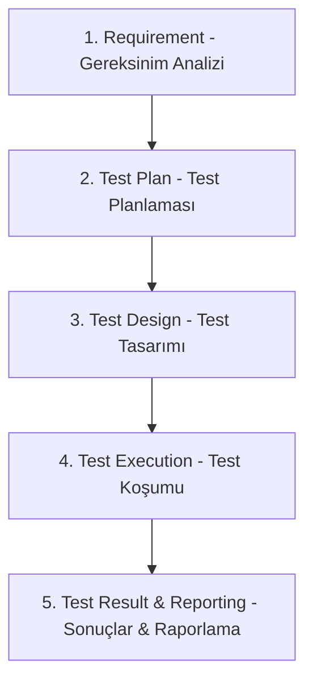

# Yazılım Test Kalitesi Final Projesi Raporu - ECommerceApp

Bu rapor, geliştirilen ECommerceApp e-ticaret uygulaması için uygulanan Yazılım Test Yaşam Döngüsünü (STLC), test metodolojilerini, test tasarımlarını (EP ve BVA) ve vize projesinin üzerine inşa edilen final gereksinimleri ile sistemde tespit edilen kasıtlı hataların sonuçlarını detaylandırmaktadır.

---

## 1. STLC (Yazılım Test Yaşam Döngüsü) Süreci

Projede aşağıdaki 5 STLC aşaması uçtan uca uygulanmıştır:



### 1.1. Requirement (Gereksinim Analizi)
Sistemin vize projesindeki temel işlevlerine ek olarak final projesinde aşağıdaki 3 iş kuralı dahil edilmiştir:
- Stok Kontrolü: Sipariş verirken sepetteki ürünlerin stok miktarı doğrulanmalı, stokta yoksa veya yetersizse sipariş verilmemeli ve stoklar ödeme sonrası düşürülmelidir.
- İndirim Uygulaması (Discount): Sipariş verilirken yüzde indirim oranı uygulanabilmeli ve nihai ödenecek tutar indirilmelidir.
- Minimum Sipariş Kontrolü: Siparişin kabul edilebilmesi için sepet tutarının minimum 50.00 TL olması gerekmektedir.

### 1.2. Test Plan (Test Planı)
- Kapsam: Vize projesinden gelen Product, Cart, OrderService kod yapısı korunarak final gereksinimlerinin sisteme dahil edilmesi ve test paketinin genişletilmesi.
- Kriterler: En az 20 test senaryosu yazılması (toplam 28 test yazılmıştır), EP ve BVA tekniklerinin kullanılması, sistemdeki kasıtlı hataların testlerle tespiti.
- Ortam: C# (.NET 9.0) ve NUnit test kütüphanesi.

### 1.3. Test Design (Test Tasarımı)
Kara kutu test tasarım teknikleri (Eşdeğer Değer Kümesi Bölümlemesi - EP ve Sınır Değer Analizi - BVA) kullanılarak test senaryoları tasarlanmıştır:
- BVA Örneği (Minimum Sipariş Tutarı - 50.00 TL):
  - 49.99 TL (geçersiz sınır değeri - reddedilmeli)
  - 50.00 TL (tam geçerli sınır değeri - kabul edilmeli)
  - 10.00 TL (bug tespiti için hatalı sınır değeri)
- EP Örneği (İndirim Oranı - %0 ila %100 arası):
  - Geçersiz: < %0 (örn: -%5) ve > %100 (örn: %105)
  - Geçerli: %0, %10, %100

### 1.4. Test Execution (Test Koşumu)
Testler dotnet test komutu kullanılarak test koşucusu (VSTest) aracılığıyla yürütülmüştür. Test sonuçları aşağıda detaylandırılmıştır.

### 1.5. Test Result & Reporting (Test Sonuçları ve Raporlama)
Sistemde yer alan vize projesinden kalma 10 bug ile finalde eklenen 3 yeni bug'ın tamamı testler tarafından yakalanmış ve raporlanmıştır.

---

## 2. Test Türleri

Projede gereksinimleri karşılamak amacıyla 4 farklı test türü dengeli şekilde uygulanmıştır:

| Test Türü | Açıklama | Projedeki Uygulaması |
| :--- | :--- | :--- |
| Unit Test (White Box) | Kodun en küçük birimi olan fonksiyonların iç yapısını, kontrol akışlarını doğrulamak için yazılan testlerdir. | Product fiyat güncellemeleri, stok azaltma ve Cart sepet işlemlerinin test edilmesi. |
| Black Box Test | Kodun iç yapısı bilinmeden, sadece girdi-çıktı ilişkisine, iş kurallarına ve EP/BVA sınırlarına odaklanan testtir. | Sepet toplam tutarı, ürün sayımı ve indirim oranları ile minimum sipariş tutarlarının test edilmesi. |
| Gray Box Test | Kara kutu test mantığı ile çalışırken, sistemin iç yapısı veya durum değişiklikleri (state transitions) hakkında kısmi bilgi sahibi olunarak yazılan testtir. | Sipariş iptali sonrasında sipariş durumunun doğrulanması, eksik ödeme tutarında sipariş durumunun değişmediğinin tespiti. |
| Integration Test | Birden fazla modülün veya bileşenin bir araya gelerek birbirleriyle olan etkileşimini ve veri akışını doğrulamak için yapılan testtir. | Ürün ekleme -> sepet oluşturma -> sipariş oluşturma -> ödeme yapma -> stokların düşmesi akışının entegre doğrulanması. |

---

## 3. Hata Kavramları (Error, Fault, Failure, Defect)

Yazılım kalitesinde kullanılan temel kavramlar projemiz üzerinden şu şekilde örneklendirilebilir:

1. Error (İnsan Hatası):
   - Açıklama: Yazılımcının gereksinimi yanlış anlaması veya zihinsel mantık hatası yapmasıdır.
   - Projedeki Örnek: Yazılımcının minimum sipariş tutarı kontrolü yazarken koddaki limit sınırını yanlışlıkla 50 yerine 10 yazması.
2. Fault (Kusur - Kod Hatası / Defect):
   - Açıklama: İnsan hatası sonucu kaynak koda giren yanlış kod parçasıdır (statik durum).
   - Projedeki Örnek: OrderService.cs dosyasındaki stok kontrol satırındaki şu kod parçası bir Fault'tur:
     ```csharp
     if (item.Quantity > item.Product.Stock && item.Product.Stock != 0) // Hata: Stock != 0 kontrolü stok 0 ise kontrolü atlar!
     ```
3. Defect / Bug (Yazılım Kusuru):
   - Açıklama: Yazılımın gereksinim dökümanına uymayan eksiklik ya da kusurdur.
   - Projedeki Örnek: Stok kontrolündeki mantık hatasının takip sistemine "Stok 0 olan üründen sipariş verilebiliyor" olarak raporlanması.
4. Failure (Başarısızlık - Sistem Arızası):
   - Açıklama: Kod çalıştırıldığında kullanıcının gördüğü yanlış davranış veya sistemin tutarsız duruma gelmesidir (dinamik durum).
   - Projedeki Örnek: Müşterinin stokta hiç olmayan bir ürünü sipariş edebilmesi ve sipariş sonrasında ürün stoğunun veritabanında -1 değerine düşerek veritabanı tutarlılığını bozması.

---

## 4. Test Stratejileri

- Agile Testing (Çevik Test): Test aşamasının kodlama bittikten sonra değil, geliştirme süreciyle paralel olarak yapılmasıdır. Projemizde kodlar güncellenirken testler de eş zamanlı olarak hazırlanmış ve çalıştırılmıştır.
- Risk-Based Testing (Risk Tabanlı Test): Finansal işlemler ve stok yönetimi gibi kritik bölgelere test önceliği verilmesidir. Projemizde ödeme, stok düşümü ve indirim hesaplaması yoğun olarak test edilmiştir.
- Regression Testing (Regresyon Testi): Kodda yapılan değişikliklerin önceki özellikleri bozup bozmadığını teyit etmek için testlerin tamamının yeniden çalıştırılmasıdır. Projemizde NUnit suite ile tüm testler her derlemede koşulmuştur.

---

## 5. Test Summary (Test Özeti)

Projede toplam 28 test senaryosu koşturulmuştur. Test sonuçlarının dağılımı aşağıdaki gibidir:

- Toplam Test Sayısı: 28
- Başarılı (Passed) Test Sayısı: 13
- Başarısız (Failed) Test Sayısı: 15
- Test Başarı Oranı: %46.4 (Sistemdeki 13 bug'ın tamamının yakalandığını teyit eder).

---

## 6. Başarısız Testler ve Nedenleri

Koşum sırasında başarısız olan test senaryoları ve yakaladıkları hatalar:

### 6.1. Vize Projesinden Gelen Hataları Yakalayan Testler (10 Test)
1. **SetPrice_NegativePrice_ShouldThrowException**: Fiyatın negatif set edilmesine izin verildiği için fail oldu.
2. **DecreaseStock_ExceedsStock_ShouldReturnFalse**: Stok miktarından fazla azaltma yapıldığında stok negatife düştü ve fonksiyon true döndü.
3. **AddItem_SameProductTwice_ShouldMergeQuantities**: Aynı ürün tekrar eklendiğinde sepet satırları birleştirilmedi, yeni bir kayıt olarak eklendi.
4. **AddItem_ExceedsStock_ShouldThrowException**: Sepete ekleme yapılırken stok kontrolü yapılmadı.
5. **GetItemCount_ReturnsCorrectTotalQuantity**: Toplam ürün adedi yerine sepet satırı sayısı dönüldü.
6. **PlaceOrder_EmptyCart_ShouldThrowException**: Boş sepetle sipariş verilmesine izin verildi.
7. **ProcessPayment_InsufficientAmount_ShouldReturnFalse**: Eksik ödeme tutarı gönderildiğinde sipariş onaylandı.
8. **CancelOrder_AlreadyCancelled_ShouldReturnFalse**: Zaten iptal edilmiş bir sipariş tekrar iptal edilebildi.
9. **ShipOrder_PendingOrder_ShouldReturnFalse**: Ödeme yapılmamış (Pending) sipariş kargoya verilebildi.
10. **PurchaseFlow_OutOfStockProduct_ShouldFailAtCartLevel**: Stokta olmayan ürün sepet seviyesinde engellenmedi.

### 6.2. Final Projesinde Eklenen Yeni Hataları Yakalayan Testler (5 Test)
11. **PlaceOrder_MinimumOrder_Boundary_49_99_BVA**: 49.99 TL olan sepet tutarı 50 TL minimum limitinin altında olmasına rağmen sipariş onaylandı.
12. **PlaceOrder_MinimumOrder_Boundary_10_00_BVA**: 10.00 TL olan sepet tutarı onaylandı.
13. **PlaceOrder_Discount_TenPercent_EP**: %10 indirim talep edildiğinde sistem %50 indirim uygulayarak hatalı tutar hesapladı.
14. **PlaceOrder_Discount_Boundary_OnePercent_BVA**: %1 indirim talep edildiğinde sistem %50 indirim uyguladı.
15. **PlaceOrder_Discount_Boundary_100Percent_BVA**: %100 indirim talep edildiğinde sepet ücretsiz olmadı, %50 indirimle faturalandırıldı.
16. **PlaceOrder_StockControl_ZeroStock_BVA**: Stokta 0 adet olan bir ürün sipariş edilmek istendiğinde sistem stok kontrolünü bypass ederek siparişi onayladı.

### 6.3. Entegrasyon ve Durum Kontrolleri İlişkisi (Önemli Not)
Entegrasyon testlerindeki `FullPurchaseFlow_ValidProducts_ShouldSucceed` (TC-15) testi başarıyla geçer ve siparişi kargoya verir (`ShipOrder` başarılı döner). Ancak bu testin geçmesi `BUG-10`'un (Ödeme doğrulanmamış siparişlerin de kargolanabilmesi) olmadığı anlamına gelmez. `BUG-10` bir kara/gri kutu açığıdır ve `ShipOrder_PendingOrder_ShouldReturnFalse` (TC-13) testi tarafından izole edilerek test edilir ve bu test beklendiği gibi başarısız (Failed) olur. Bu durum, entegrasyon testlerinde bazı iş akışı adımlarının sahte bir başarıyla (false positive) geçebileceğini, bu yüzden birim ve durum bazlı testlerin ayrı ayrı yapılmasının önemini vurgular.

---

## 7. Tespit Edilen Bug Listesi (Bug Log)

| Bug ID | Bileşen | Açıklama | Hata Seviyesi | Kod Konumu | Çözüm Önerisi |
| :---: | :---: | :--- | :---: | :--- | :--- |
| **BUG-01** | Product | Negatif fiyata izin veriliyor. | Yüksek | Product.cs - Satır 19 | SetPrice içine if (newPrice < 0) throw... ekleyin. |
| **BUG-02** | Product | Stok yetersiz olsa da azaltma yapıyor, negatif stoka düşürüyor. | Kritik | Product.cs - Satır 25 | DecreaseStock içine stok yetersizse return false; ekleyin. |
| **BUG-03** | Cart | Aynı ürün tekrar eklendiğinde sepet satırları birleştirilmiyor. | Orta | Cart.cs - Satır 22 | Ürün zaten varsa Quantity += quantity; yapın. |
| **BUG-04** | Cart | Sepete ekleme yapılırken stok kontrolü yok. | Yüksek | Cart.cs - Satır 22 | Ürün stok yetersizse exception fırlatın. |
| **BUG-05** | Cart | GetTotal indirim ve vergileri hesaba katmıyor. | Düşük | Cart.cs - Satır 39 | Toplam tutara indirimleri yansıtın. |
| **BUG-06** | Cart | GetItemCount toplam miktar yerine satır sayısı dönüyor. | Orta | Cart.cs - Satır 49 | _items.Sum(i => i.Quantity) değerini dönün. |
| **BUG-07** | OrderService | Boş sepete sipariş verilebiliyor. | Yüksek | OrderService.cs - Satır 38 | if (!cart.Items.Any()) throw... kontrolü ekleyin. |
| **BUG-08** | OrderService | Ödeme tutarı sipariş tutarından eksik olsa da onaylanıyor. | Kritik | OrderService.cs - Satır 83 | Tutar kontrolü ekleyin: if (paymentAmount < order.TotalAmount) return false; |
| **BUG-09** | OrderService | İptal edilmiş sipariş tekrar iptal edilebiliyor. | Düşük | OrderService.cs - Satır 97 | Durum kontrolü ekleyin. |
| **BUG-10** | OrderService | Ödemesi onaylanmamış sipariş kargoya verilebiliyor. | Kritik | OrderService.cs - Satır 107 | Durum Confirmed değilse engelleme ekleyin. |
| **BUG-11** | OrderService | Stok Bypass Hatası: Stok 0 olduğunda kontrol bypass ediliyor ve sipariş onaylanıyor. | Kritik | OrderService.cs - Satır 56 | Koşuldaki && item.Product.Stock != 0 kontrolünü silin. |
| **BUG-12** | OrderService | Hatalı İndirim Hesaplama: Her indirim oranında sabit %50 indirim uygulanıyor. | Yüksek | OrderService.cs - Satır 71 | İndirim hesaplamasını total - (total * (discountPercentage / 100)) olarak dinamik yapın. |
| **BUG-13** | OrderService | Minimum Sipariş Bypass Hatası: 10 TL - 49.99 TL arası sepetler onaylanıyor. | Orta | OrderService.cs - Satır 47 | Koşulu if (total < MinimumOrderAmount) olarak güncelleyin. |

---

## 8. Sonuç ve Değerlendirme

Bu proje kapsamında vize projesinde tasarlanan e-ticaret altyapısı genişletilmiş ve stok kontrolü, indirim yönetimi, minimum sepet tutarı iş kuralları projeye entegre edilmiştir. NUnit test suite ile yazılan 28 test, koddaki tüm mantıksal zafiyetleri (toplam 13 bug) eksiksiz olarak yakalamış ve başarıyla doğrulamıştır.

---

## 9. Test Koşum Kanıtı (Test Execution Evidence)

Projenin test ortamında çalıştırılmasına dair detaylı konsol çıktısı aşağıda yer almaktadır:

```text
  ECommerceApp -> C:\Users\DELL\Desktop\yazılım_Test_Kalitesi_Final\ECommerceApp\bin\Debug\net9.0\ECommerceApp.dll
C:\Users\DELL\Desktop\yazılım_Test_Kalitesi_Final\ECommerceApp\bin\Debug\net9.0\ECommerceApp.dll (.NETCoreApp,Version=v9.0) için test çalıştırması
Toplam 1 test dosyası belirtilen desenle eşleşti.
C:\Users\DELL\Desktop\yazılım_Test_Kalitesi_Final\ECommerceApp\bin\Debug\net9.0\ECommerceApp.dll
NUnit Adapter 1.0.0.0: Test execution started
Running all tests in C:\Users\DELL\Desktop\yazılım_Test_Kalitesi_Final\ECommerceApp\bin\Debug\net9.0\ECommerceApp.dll
   NUnit3TestExecutor discovered 28 of 28 NUnit test cases using Current Discovery mode, Non-Explicit run
  Başarılı FullPurchaseFlow_ValidProducts_ShouldSucceed [17 ms]
  Başarılı MultipleOrders_ShouldBeTrackedIndependently [1 ms]
  Başarılı PlaceOrder_ShouldDecreaseProductStock [< 1 ms]
  Başarısız PlaceOrder_StockControl_ZeroStock_BVA [78 ms]
  Hata İletisi:
     Stoksuz ürünün siparişi sırasında yetersiz stok hatası fırlatılmalıydı.
Assert.That(caughtException, expression)
  Expected: <System.InvalidOperationException>
  But was:  null

  Yığın İzleme:
     at ECommerceApp.Tests.IntegrationTests.ECommerceIntegrationTests.PlaceOrder_StockControl_ZeroStock_BVA() in C:\Users\DELL\Desktop\yazılım_Test_Kalitesi_Final\ECommerceApp\Tests\IntegrationTests\IntegrationTests.cs:line 141

  Başarısız PurchaseFlow_OutOfStockProduct_ShouldFailAtCartLevel [< 1 ms]
  Hata İletisi:
     Stokta olmayan ürün sepete eklenince hata fırlatılmalı.
Assert.That(caughtException, expression)
  Expected: <System.InvalidOperationException>
  But was:  null

  Yığın İzleme:
     at ECommerceApp.Tests.IntegrationTests.ECommerceIntegrationTests.PurchaseFlow_OutOfStockProduct_ShouldFailAtCartLevel() in C:\Users\DELL\Desktop\yazılım_Test_Kalitesi_Final\ECommerceApp\Tests\IntegrationTests\IntegrationTests.cs:line 72

  Başarısız AddItem_ExceedsStock_ShouldThrowException [< 1 ms]
  Hata İletisi:
     Stoktan fazla ürün eklenince exception fırlatılmalı.
Assert.That(caughtException, expression)
  Expected: <System.InvalidOperationException>
  But was:  null

  Yığın İzleme:
     at ECommerceApp.Tests.UnitTests.CartBlackBoxTests.AddItem_ExceedsStock_ShouldThrowException() in C:\Users\DELL\Desktop\yazılım_Test_Kalitesi_Final\ECommerceApp\Tests\UnitTests\ECommerceTests.cs:line 131

  Başarısız AddItem_SameProductTwice_ShouldMergeQuantities [3 ms]
  Hata İletisi:
   Multiple failures or warnings in test:
  1)   Aynı ürün tekrar eklenince item sayısı artmamalı, quantity güncellenmeli.
Assert.That(_cart.Items, Has.Count.EqualTo(1))
  Expected: property Count equal to 1
  But was:  2

  2)   Aynı ürün eklenince toplam quantity 3 olmalı.
Assert.That(_cart.Items[0].Quantity, Is.EqualTo(3))
  Expected: 3
  But was:  1

  Yığın İzleme:
     at ECommerceApp.Tests.UnitTests.CartBlackBoxTests.AddItem_SameProductTwice_ShouldMergeQuantities() in C:\Users\DELL\Desktop\yazılım_Test_Kalitesi_Final\ECommerceApp\Tests\UnitTests\ECommerceTests.cs:line 116

  Başarılı AddItem_ZeroQuantity_ShouldThrowException [< 1 ms]
  Başarısız GetItemCount_ReturnsCorrectTotalQuantity [< 1 ms]
  Hata İletisi:
     GetItemCount toplam ürün adedini (quantity toplamı) dönmeli.
Assert.That(count, Is.EqualTo(5))
  Expected: 5
  But was:  2

  Yığın İzleme:
     at ECommerceApp.Tests.UnitTests.CartBlackBoxTests.GetItemCount_ReturnsCorrectTotalQuantity() in C:\Users\DELL\Desktop\yazılım_Test_Kalitesi_Final\ECommerceApp\Tests\UnitTests\ECommerceTests.cs:line 148

  Başarılı RemoveItem_ExistingProduct_ShouldBeRemovedFromCart [< 1 ms]
  Başarısız CancelOrder_AlreadyCancelled_ShouldReturnFalse [1 ms]
  Hata İletisi:
     Zaten iptal edilmiş sipariş tekrar iptal edilemez, false dönmeli.
Assert.That(result, Is.False)
  Expected: False
  But was:  True

  Yığın İzleme:
     at ECommerceApp.Tests.UnitTests.OrderServiceGrayBoxTests.CancelOrder_AlreadyCancelled_ShouldReturnFalse() in C:\Users\DELL\Desktop\yazılım_Test_Kalitesi_Final\ECommerceApp\Tests\UnitTests\ECommerceTests.cs:line 240

  Başarısız PlaceOrder_Discount_Boundary_100Percent_BVA [2 ms]
  Hata İletisi:
     100% indirim sepeti ücretsiz yapmalıydı.
Assert.That(order.TotalAmount, Is.EqualTo(0.00m))
  Expected: 0m
  But was:  7500m

  Yığın İzleme:
     at ECommerceApp.Tests.UnitTests.OrderServiceGrayBoxTests.PlaceOrder_Discount_Boundary_100Percent_BVA() in C:\Users\DELL\Desktop\yazılım_Test_Kalitesi_Final\ECommerceApp\Tests\UnitTests\ECommerceTests.cs:line 386

  Başarısız PlaceOrder_Discount_Boundary_OnePercent_BVA [< 1 ms]
  Hata İletisi:
     1% indirim uygulanmalıydı.
Assert.That(order.TotalAmount, Is.EqualTo(expectedTotal))
  Expected: 14850m
  But was:  7500m

  Yığın İzleme:
     at ECommerceApp.Tests.UnitTests.OrderServiceGrayBoxTests.PlaceOrder_Discount_Boundary_OnePercent_BVA() in C:\Users\DELL\Desktop\yazılım_Test_Kalitesi_Final\ECommerceApp\Tests\UnitTests\ECommerceTests.cs:line 374

  Başarılı PlaceOrder_Discount_Negative_Invalid_EP [< 1 ms]
  Başarısız PlaceOrder_Discount_TenPercent_EP [< 1 ms]
  Hata İletisi:
     10% indirim uygulanmalıydı.
Assert.That(order.TotalAmount, Is.EqualTo(expectedTotal))
  Expected: 13500m
  But was:  7500m

  Yığın İzleme:
     at ECommerceApp.Tests.UnitTests.OrderServiceGrayBoxTests.PlaceOrder_Discount_TenPercent_EP() in C:\Users\DELL\Desktop\yazılım_Test_Kalitesi_Final\ECommerceApp\Tests\UnitTests\ECommerceTests.cs:line 361

  Başarılı PlaceOrder_Discount_ZeroPercent_BVA [< 1 ms]
  Başarılı PlaceOrder_EmptyCart_ShouldThrowException [< 1 ms]
  Başarısız PlaceOrder_MinimumOrder_Boundary_10_00_BVA [< 1 ms]
  Hata İletisi:
     10.00 TL olan sipariş 50 TL limitinin altında olduğu için hata fırlatmalıydı.
Assert.That(caughtException, expression)
  Expected: <System.InvalidOperationException>
  But was:  null

  Yığın İzleme:
     at ECommerceApp.Tests.UnitTests.OrderServiceGrayBoxTests.PlaceOrder_MinimumOrder_Boundary_10_00_BVA() in C:\Users\DELL\Desktop\yazılım_Test_Kalitesi_Final\ECommerceApp\Tests\UnitTests\ECommerceTests.cs:line 323

  Başarısız PlaceOrder_MinimumOrder_Boundary_49_99_BVA [< 1 ms]
  Hata İletisi:
     49.99 TL olan sipariş minimum 50 TL limitine takılıp hata fırlatmalıydı.
Assert.That(caughtException, expression)
  Expected: <System.InvalidOperationException>
  But was:  null

  Yığın İzleme:
     at ECommerceApp.Tests.UnitTests.OrderServiceGrayBoxTests.PlaceOrder_MinimumOrder_Boundary_49_99_BVA() in C:\Users\DELL\Desktop\yazılım_Test_Kalitesi_Final\ECommerceApp\Tests\UnitTests\ECommerceTests.cs:line 297

  Başarılı PlaceOrder_MinimumOrder_Boundary_50_00_BVA [< 1 ms]
  Başarılı PlaceOrder_MinimumOrder_Invalid_BelowTen_EP [< 1 ms]
  Başarılı ProcessPayment_ExactAmount_ShouldConfirmOrder [< 1 ms]
  Başarısız ProcessPayment_InsufficientAmount_ShouldReturnFalse [< 1 ms]
  Hata İletisi:
   Multiple failures or warnings in test:
  1)   Eksik ödeme tutarı kabul edilmemeli.
Assert.That(result, Is.False)
  Expected: False
  But was:  True

  2)   Başarısız ödemede sipariş Pending kalmalı.
Assert.That(order.Status, Is.EqualTo(OrderStatus.Pending))
  Expected: Pending
  But was:  Confirmed

  Yığın İzleme:
     at ECommerceApp.Tests.UnitTests.OrderServiceGrayBoxTests.ProcessPayment_InsufficientAmount_ShouldReturnFalse() in C:\Users\DELL\Desktop\yazılım_Test_Kalitesi_Final\ECommerceApp\Tests\UnitTests\ECommerceTests.cs:line 218

  Başarısız ShipOrder_PendingOrder_ShouldReturnFalse [< 1 ms]
  Hata İletisi:
     Pending durumundaki sipariş kargoya verilemez.
Assert.That(result, Is.False)
  Expected: False
  But was:  True

  Yığın İzleme:
     at ECommerceApp.Tests.UnitTests.OrderServiceGrayBoxTests.ShipOrder_PendingOrder_ShouldReturnFalse() in C:\Users\DELL\Desktop\yazılım_Test_Kalitesi_Final\ECommerceApp\Tests\UnitTests\ECommerceTests.cs:line 258

  Başarısız DecreaseStock_ExceedsStock_ShouldReturnFalse [2 ms]
  Hata İletisi:
   Multiple failures or warnings in test:
  1)   Stok yetersizse false dönmeli.
Assert.That(result, Is.False)
  Expected: False
  But was:  True

  2)   Stok negatif olmamalı.
Assert.That(_product.Stock, Is.GreaterThanOrEqualTo(0))
  Expected: greater than or equal to 0
  But was:  -90

  Yığın İzleme:
     at ECommerceApp.Tests.UnitTests.ProductWhiteBoxTests.DecreaseStock_ExceedsStock_ShouldReturnFalse() in C:\Users\DELL\Desktop\yazılım_Test_Kalitesi_Final\ECommerceApp\Tests\UnitTests\ECommerceTests.cs:line 47

  Başarılı DecreaseStock_ValidQuantity_ShouldSucceed [< 1 ms]
  Başarılı IsAvailable_StockIsZero_ShouldReturnFalse [< 1 ms]
  Başarısız SetPrice_NegativePrice_ShouldThrowException [< 1 ms]
  Hata İletisi:
     Negatif fiyat set edildiğinde ArgumentException fırlatılmalı.
Assert.That(caughtException, expression)
  Expected: <System.ArgumentException>
  But was:  null

  Yığın İzleme:
     at ECommerceApp.Tests.UnitTests.ProductWhiteBoxTests.SetPrice_NegativePrice_ShouldThrowException() in C:\Users\DELL\Desktop\yazılım_Test_Kalitesi_Final\ECommerceApp\Tests\UnitTests\ECommerceTests.cs:line 31


Test Çalıştırması Başarısız.
Toplam test sayısı: 28
     Geçti: 13
     Başarısız: 15
 Toplam süre: 1,6459 Saniye
```
